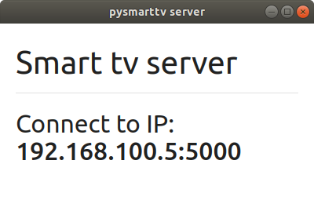
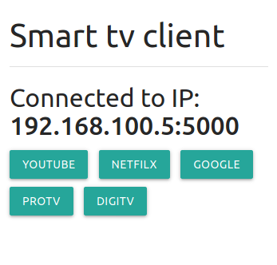
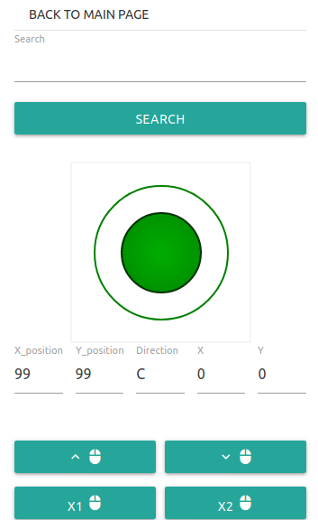

# pysmarttv
Control the laptop from the phone using python 

Install the requirements : `flask, waitress, flaskwebgui, selenium` (get the chrome driver for selenium also)

Run the server `python pysmarttv.py` and connect to the ip suggested:

Bellow is the main page which shows the IP you are connected to and the pages you can control.

Curently only youtube can be controled.

Bellow is the control page which has a few sections
- back to main page
- search youtube
- control mouse (up down left right)
- scroll up - scroll down
- click - double click
- fullscreen - exit full screen
- space_bar

#It seems Flask can't handle the level of requests needed to control the mouse even with waitress as application server..

